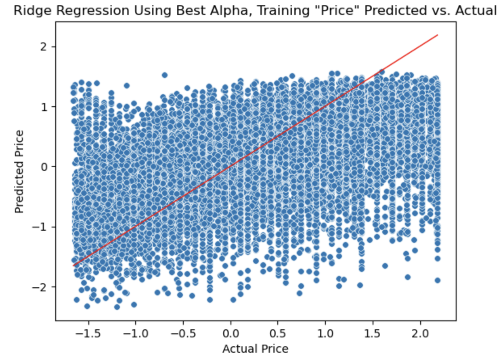
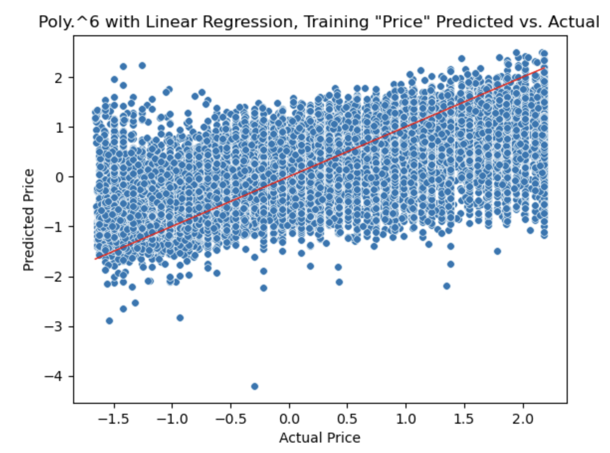

# What factor(s) determine the price of a car?

## Data Preparation

Originally, the data contained 426880 records with the following columns:

```
id, region, price, year, manufacturer, model, condition, cylinders, fuel, odometer, title_status, transmission, VIN, drive, size, type, paint_color, size
```'

On initial inspection, using 'VIN', 'price' & 'odometer', the data contained 215109 duplicate rows which were removed (keeping one copy). The following column were dropped as they did not contain useful information: 'id', 'VIN', 'size', 'cylinders','condition','drive','paint_color','type'. After type conversion, the categorical data was encoded ('region', 'transmission','fuel','odometer','model','title_status','manufacturer','state') using OrdinalEncoder. Rows with a price <= 1,000 and > 25,000 were also removed (the decision for this, and the following, modification came after a histogram of the remaining columns to identify outliers). Rows with 'year' < 1925 were also removed. Finally, rows with 'odometer' < 1,000 and > 400,000 were also dropped. This resulted in a data set of 135395 rows.

Histogram of the data:


What can be seen from these plots is that several of the columns contain singluar data that will not yield an even distribution. Namely: 'fuel','title_status','transmission'. Also, the distribution for 'year' starts somewhere in the 1980 region; data before then was dropped.

Final histogram of data:


A final review of the data was conducted using a box plot for each column:


Here we see a relatively consistent distribution of data. The 'year' distribution reflects distinct segments of years of car purchases up until the year 1998.


The final step of the data preparation was its scaling using the StandardScaler:


## Analysis and Modeling

The first step was to visualize a linear regression of the entire data set using a scatter plot which yielded:
```
Training MSE 0.6157159444871375 Development MSE 0.6204597680972314
Coefficients [-0.01796291  0.35782479 -0.0380825   0.03416006 -0.35935447 -0.0338324 ]
```


Both of the MSE are small and close to one another. The coefficients also suggest the desired intercept. The curve in the 'residuals' suggests that there is another factor (perhaps or more of the dropped columns that plays a part in the prediction)

The Principal Component Analysis yielded:
```
Percent variance: 1.0000000000000002
Number components necessary to retain 80% variance: 5
```


With a data set of this size (133259,6 (excluding 'price')), it is intuitive that more features would be needed to  accurately predict the car-selling price.

The Sequential Feature Selection (SFS), on the other hand, suggested that the number of features to use should be 2: 1st 'year' and 2nd 'odometer':


Running a linear regression on these two features, yielded:
```
Training MSE 0.6196149566575472 Development MSE 0.6247777109872433
Score 0.3778589646211781
```
SFS suggests that the best predictor of a price of a car is (1) year and (1) year and (2) odometer.


We see that the MSEs here are almost identical to those when all 6 features were used in the original linear regression.

The best alpha value for Ridge regression was calculated using GridSearchCV and input alpha values of 100^-5 - 100^5. The GridSearchCV was also fitted and predictions were made for the training and development data:
```
Training MSE 0.6157159888162558 Development MSE 0.6204584097035241
Score 0.38216003766765405 Best Alpha 46.41588833612773
```
Ridge regression was then ran using alpha equal to 46.41588833612773 and yielded:
```
Training MSE 0.6157159888162558 Development MSE 0.6204584097035241
```


This, of course, are the same results as when calculating the best alpha value.

Permutation Feature Importance was ran using the GridSearchCV and Ridge model.
```
r2
    model         0.258 +/- 0.004
    price         0.256 +/- 0.003
    manufacturer  0.003 +/- 0.000
    year          0.003 +/- 0.000
    odometer      0.002 +/- 0.000
    region        0.001 +/- 0.000
neg_mean_absolute_percentage_error
    model         0.105 +/- 0.024
    price         0.097 +/- 0.033
    manufacturer  0.015 +/- 0.003
neg_mean_squared_error
    model         0.259 +/- 0.004
    price         0.257 +/- 0.003
    manufacturer  0.003 +/- 0.000
    year          0.003 +/- 0.000
    odometer      0.002 +/- 0.000
    region        0.001 +/- 0.000
```
Interestingly, none of these resemble the selections made by SFS. If 'price' were to be removed, the remaining feature importance scores are very marginal. All three measurements list 'model' as the feature of greatest significance.

Lasso regression returned 0.0 as the best alpha value.


```
Training MSE 0.6157159444871376 Development MSE 0.6204597680972314
```
This model does not vary significantly from the other attempts. The plot and MSEs are almost identical. As mentioned earlier, the data set was problematic from the beginning and required significant alteration/truncation. As such, the final approach was to use PolynomialFeatures to introduce polynomial "versions" of the existing data to enrich the data set.

Leveraging GridSearchCV with PolynomialFeatures & linear regression yielded the optimal number of polynomial degrees:
```
Training MSE 0.49316110284894105 Development MSE 0.5057053688301261
Score 0.4964287998311331
Best Model Pipeline(steps=[('poly_features',
                 PolynomialFeatures(degree=6, include_bias=False)),
                ('lreg', LinearRegression())])
Best polynomial degree: 6
```
Finally, there are MSEs that are lower (different) from all of the other attempts and the score is higher.



## Conclusion

Before modeling can be considered, it is imperative to understand the data. To 'understand' it requires an expertise that is part art. Here, the discovery that records were duplicated would have hurt any efforts in prediction. At the same time, it is important to have 'enough' data and variance (number of features AND variability within each). This process is a predictor (pun intended) of the efficacy of the model.

Modeling requires experience but at this point, requires to try multiple approaches to determine which is most likely to be accurate, using tools like  cross-validation, r^2, MSE etc.

The response to the initial question of 'What factor(s) determine the price of a car?' is 'it depends'. The different models yielded very similar results. R^2, neg_mean_absolute_percentage_error, neg_mean_squared_error suggest 'model'. The final test, using polynomial features, uses all of the features and creates polynomial combinations to the power of 6 (46656 columns).

```
Features: ['region' 'year' 'manufacturer' 'model' 'odometer' 'state']
 Feature powers: [[1 0 0 0 0 0]
 [0 1 0 0 0 0]
 [0 0 1 0 0 0]
 ...
 [0 0 0 0 2 4]
 [0 0 0 0 1 5]
 [0 0 0 0 0 6]]
```