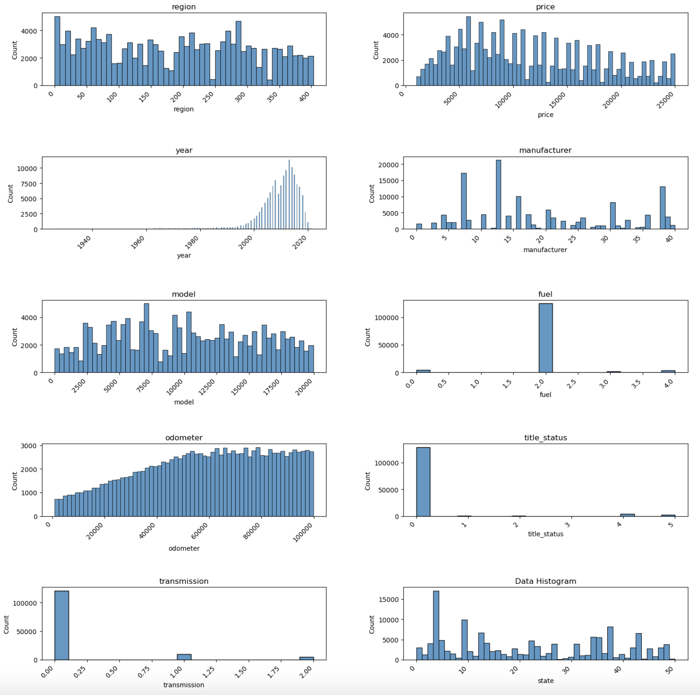
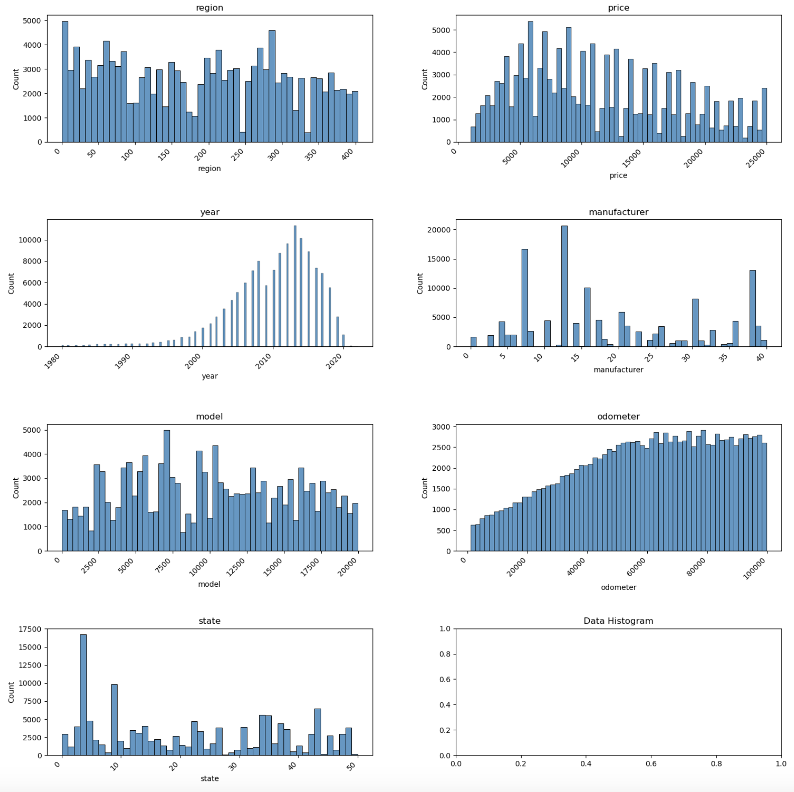
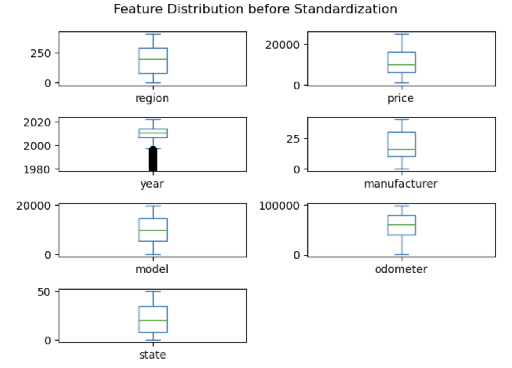
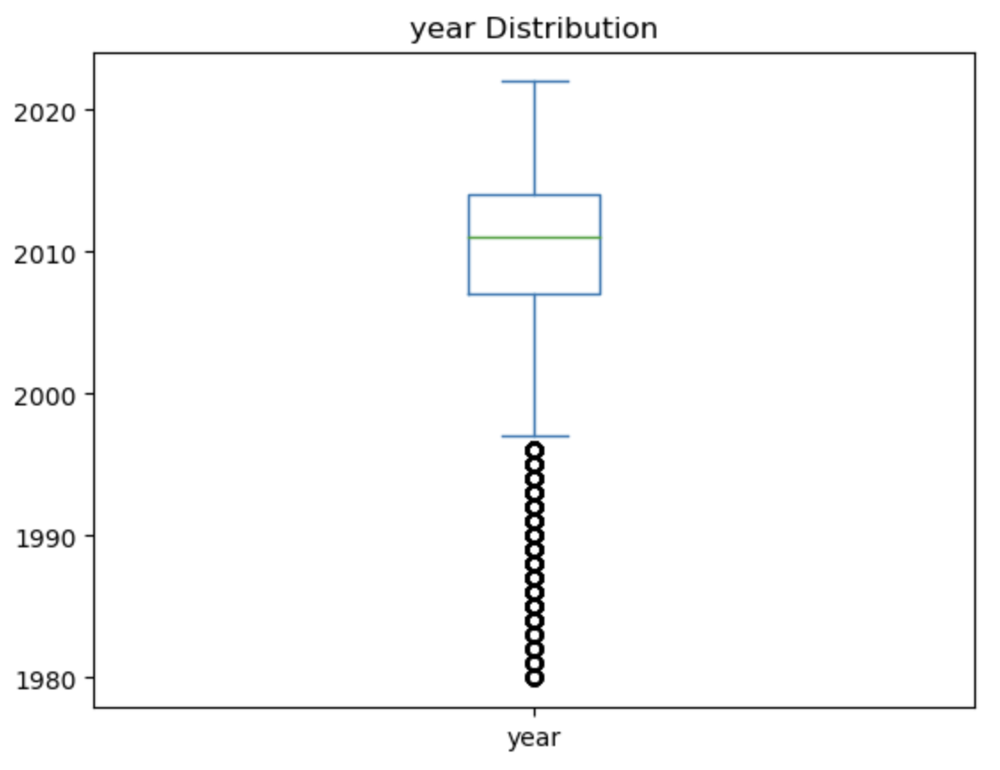
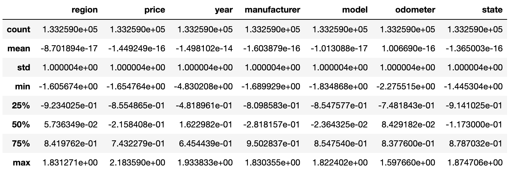
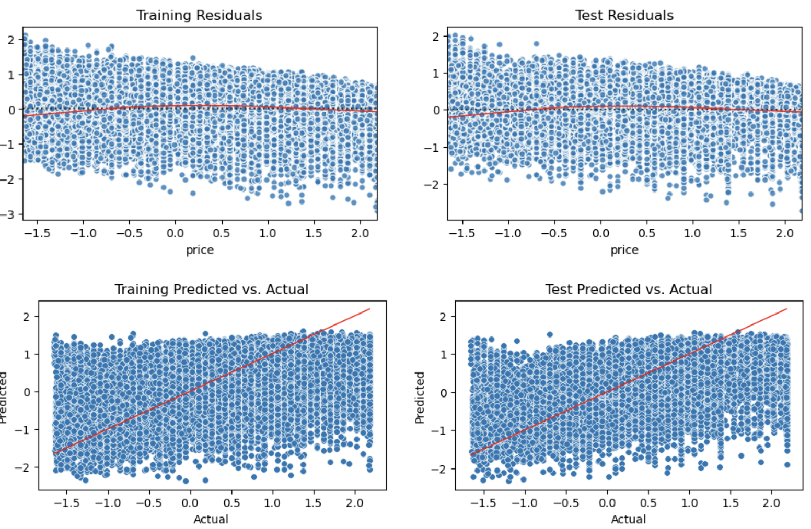
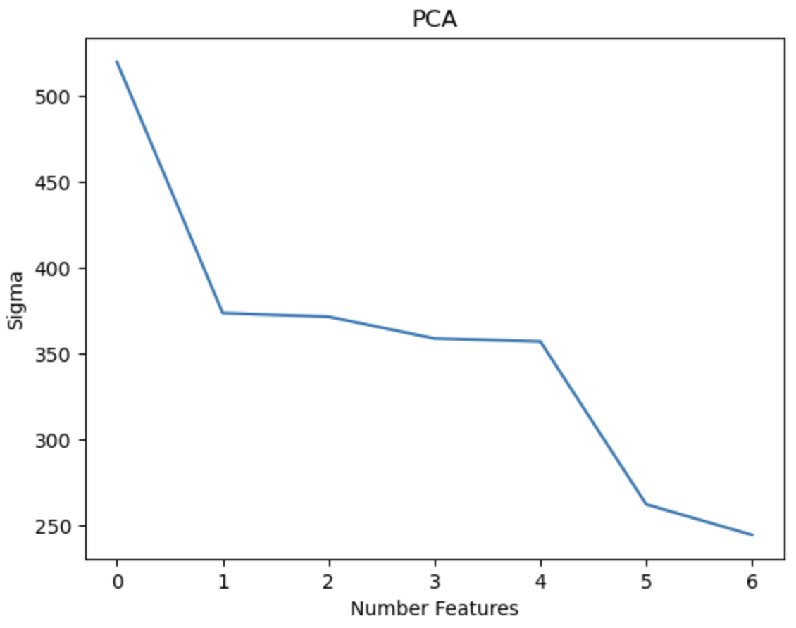
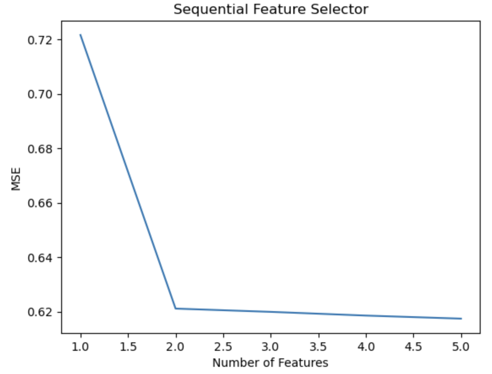
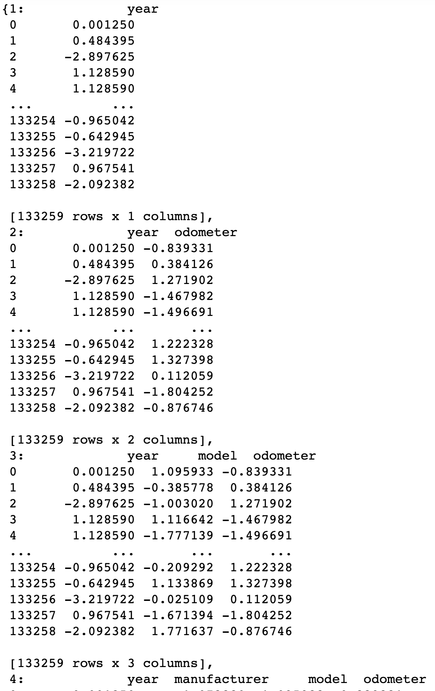
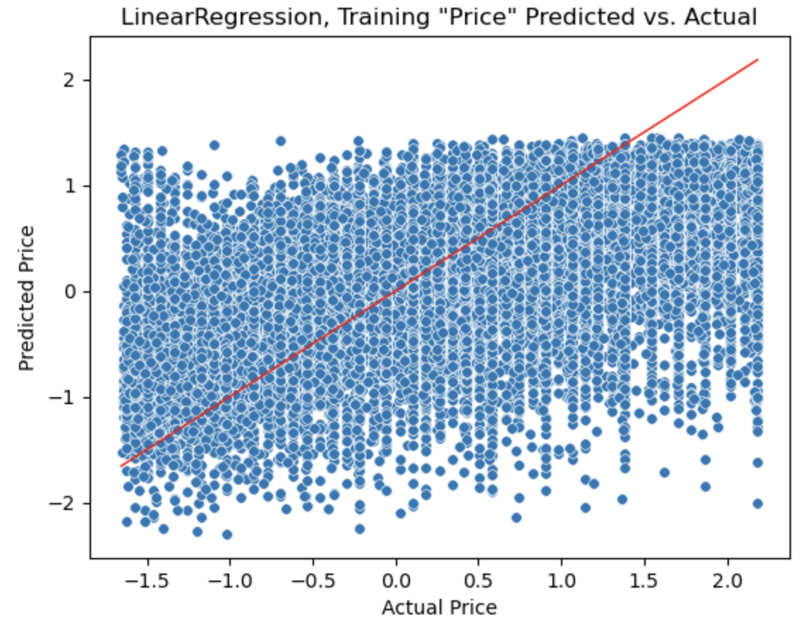

# What factor(s) determine the price of a car?

## Data Preparation

Originally, the data containied 426880 records with the following columns:

id, region, price, year, manufacturer, model, condition, cylinders, fuel, odometer, title_status, transmission, VIN, drive, size, type, paint_color, size

On initial inspection, using 'VIN', 'price' & 'odometer', the data contained 215109 duplicate rows which were removed (keeping one copy). The following column were dropped as they did not contain useful information: 'id', 'VIN', 'size', 'cylinders','condition','drive','paint_color','type'. After type conversion, the categorical data was encoded ('region', 'transmission','fuel','odometer','model','title_status','manufacturer','state') using OrdinalEncoder. Rows with a price <= 1,000 and > 25,000 were also removed (the decision for this, and the following, modification came after a histogram of the remaining columns to identify outliers). Rows with 'year' < 1925 were also removed. Finally, rows with 'odometer' < 1,000 and > 400,000 were also dropped. This resulted in a data set of 135395 rows.

Histogram of the data:

What can be seen from these plots is that several of the columns contain singluar data that will not yield an even distribution. Namely: 'fuel','title_status','transmission'. Also, the distribution for 'year' starts somewhere in the 1980 region; data before then was dropped.

Final histogram of data:

A final review of the data was conducted using a box plot for each column:

Here we see a relatively consistent distribution of data. The 'year' distribution reflects distinct segments of years of car purchases up until the year 1998.

The final step of the data preparation was its scaling using the StandardScaler:

## Analysis and Modeling

The first step was to visualize a linear regression of the entire data set using a scatter plot which yielded:

Training MSE 0.6157159444871375 Development MSE 0.6204597680972314
Coefficients [-0.01796291  0.35782479 -0.0380825   0.03416006 -0.35935447 -0.0338324 ]

Both of the MSE are small and close to one another. The coefficients also suggest the desired intercept. The curve in the 'residuals' suggests that there is another factor (perhaps or more of the dropped columns that plays a part in the prediction)

The Principal Component Analysis yielded:

Percent variance: 1.0000000000000002
Number components necessary to retain 80% variance: 5

With a data set of this size (133259,6 (excluding 'price')), it is intuitive that more features would be needed to  accurately predict the car-selling price.

The Sequential Feature Selection, on the other hand, suggested that the number of features to use should be 2: 'year' and 'odometer':

Running a linear regression on these two features, yielded:

Training MSE 0.6196149566575472 Development MSE 0.6247777109872433
Score 0.3778589646211781

We see that the MSEs here are almost identical to those when all 6 features were used in the original linear regression.

